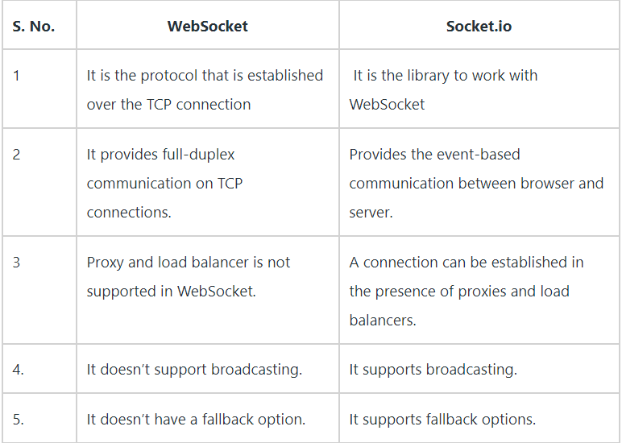

# Socket.io

## Web Sockets

1- What is a Web Socket?

>it's a communication protocol between computers uses the TCP duplex channels and it's built over HTTP using HTTP upgrade header

2- Describe the Web Socket request/response handshake and what happens once the connection is established

>once the user send a request through the web client, the handshake process starts with an HTTP request/response through a connection to a port, once connection established, the communication protocol changes to bidirectional binary which doesn't conform the HTTP, but do with WebSocket then the client sends an websocket key asking for security using base64 and the server respone with that key but hashed in a new header called `Sec-WebSocket-Accept` to prevent cashing proxy.

3- Web Sockets provide a standardized way for the server to send content to a client without first receiving a ____ from that client

>A request

## Socket.io Tutorial

1- What does the event handler io.on() do?

>The io.on event handler handles connection, disconnection, etc., events in it, using the socket object.

2-Describe some possible proof of life or proof that the code works as expected

>for example this code prove the code is live

   ``` javascript
   io.on('connection', function(socket){
   console.log('A user connected');
   ```

   >which means that when the user is connected using HTTP request, our socket will react to that event by console.log the message illustrated above.

3-What does socket.emit() do?

>Creates and fires custom events

## Socket.io vs Web Sockets

1- What is the difference between WebSocket and Socket.IO? (think Git and GitHub, or OAuth and Auth0).

Websocket is as we define it previously in the first question, while socket.io is a library, could be used with many programming environments, but we will use in node.js to build real time applications, it is built over the Websocket concept also it has like two components, one used in the client-side and the other on the server-side. both has same API.

2- When would you use Socket.IO?

>It handle all the degradation of your technical alternatives to get full-duplex communication in real-time.

>It also handles the various support level and the inconsistencies from the browser.

>It also gives the additional feature room support for basic publish infrastructure and thinks like automatic reconnect.
Currently, AFAIK is the most used one and easier to help with vanilla web sockets.

3- When would you use WebSockets?

>It provides full-duplex communication, which helps in persisting the connection established between the Client and the Web Server.

>It also lives up to the standards and provides the accuracy and efficiency stream events to and from with negligible latency.

>WebSocket removes the overhead and reduce complexity.
It makes real-time communication effortless and efficient.



## OSI Model Explained

What are a couple of key takeaways from this video?

It breakdown the data transporting model, OSI (Open system interconnection) which includes 7 main layers that control the whole procedure.

>Application Layer: mainly responsible on defining the protocls used in each process a web or internet application uses.

>Presentation Layer: it is responsible about 3 main processes, Translation , compression and encryption/decryption of data.  so it transforms the data recieved or sent from an application and reduces it size by compression to make the transportation faster, also that data is being encrypted before sent by SSL(Secure Socket Layer).

>Session Layer: it is like a manager, for each process it keeps an eye on it using authentication , authorization and watching over data packets(data are distributed in packets based on their category before sending them).

>Transport Layer: the one we are using socket.io and Websocket on, which is responsible over using protocls that controls  data transporting from one machine to another,  first data is sigmented by this layer into smaller units, these units has like pointers to which device it should be passed, and then flow control means each device has a capabiltiy or speed of sending data, so this layer maintain the confromity between these differntiations. lasty the data is passed over a protocol to check if the sent data done correctly mainly UDP or TCP, usually UDP for connectionless data while TCP for connections.

>Network Layer: it determines the right path of sending data and determines the fastest way of sending it.

>Data Link Layer: is responsible about integration of converting data based on the media it is transporting in to meet a suitable form for other media connected devices, i.e data through a cable has different framing than data transported through wifi, data link layer transform the data between these so it will be suitable to transport without change.


>Physical Layer: it's more of a hardware layer thing, about electricity and how data is transferred using different transporting method, electricity, light or waves. it translated these signals to a computer lanuage to be understood.

## Translate the gist of this video to a non-technical friend

it's like a restaurant and a customer, where the restaurant is the server, and customer is the client, to make a TCP connection in that situation it's done by 3 handshake deals, it's like 3 agreements to reach a deal.

>1- first the customer says I want food (client asking for server connections).

>2- the restaurant acknowledge this request and says okay, I agree to serve you food, but do you have money? (the server asking the client to open his connection so it can link to it).

>3- the cutomer says yes I have!, so the restaurant serves food (here the client open connection and the server connect to it making a two (full-duplex) channel to exchange data through).


## Things I want to know more about

How to control event's in a way that won't cause glitches of the user interface using socket.io and to not leak unwanted data from the server at a point of time.